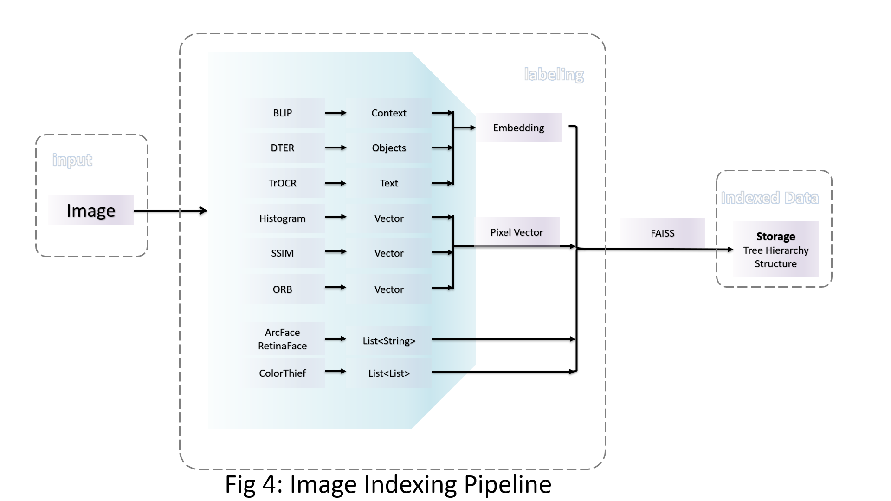
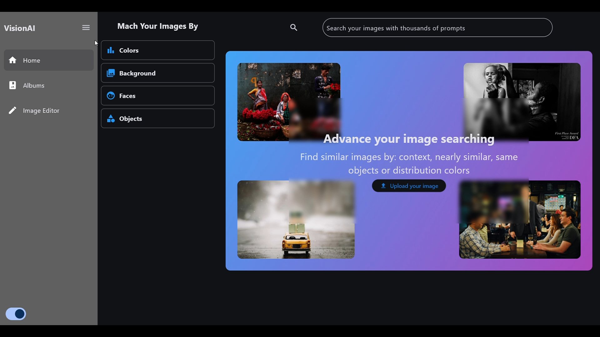

Here is an expanded and more professional README file for your **VisionAI** project, incorporating details from your code and the graduation report.

---

# VisionAI: Context-Aware Image Retrieval and Intelligent Editing

VisionAI is an intelligent image management and retrieval system designed to transform how users interact with their personal galleries. By leveraging deep learning, the system moves beyond simple file storage to provide context-aware searching, automatic organization, and AI-powered image editing. 

## 🚀 About VisionAI

VisionAI acts as a smart gallery that understands the "what," "where," and "who" of your photos. It uses a multi-modal approach to index images based on visual features, detected objects, text, and environmental context. 

### Key Features:

* 
**Contextual Search:** Find images using natural language descriptions (e.g., "birthday party with family" or "documents about AI"). 

* 
**Automatic Album Clustering:** Images are automatically grouped into logical albums based on similarity in objects, backgrounds, and time. 

* 
**Intelligent Editing:** Professional-grade filters including "Pure Skin" and brightness/contrast adjustments tailored to image content. 

* 
**OCR Integration:** Search for images containing specific text, such as book titles or notes. 

## 🖥️ Interfaces

The user interface is built with Flutter, providing a seamless experience for browsing and searching through large image databases.

## 📊 Explaining the Dataset

The system is tested on a robust dataset designed to simulate a real-world user gallery. 

* 
**Size:** Over 6,100 images. 

* 
**Metadata Fields:** Each image is enriched with 13 data points, including: 

* **Captions:** Generated descriptions of the scene.
* **Faces:** Detected face labels and counts.
* **Objects:** Multi-label object detection (e.g., "cake," "dining table," "fork").
* **Background Class:** Environmental categorization (e.g., "bakery," "indoor," "park").
* **Color Palette:** Dominant RGB values for color-based filtering.
* **Text (OCR):** Extracted text for document and sign identification.

* 
**Categories:** Images are mapped into broad categories like "Food & Drinks," "Tools & Utensils," "Sports," and "Indoor/Outdoor" scenes. 

## 📂 Journey Through the Folders and Files

### Front-End (Flutter)

The mobile application handles user interaction and communicates with the AI services.

* **`/front-end/lib/controller/`**: Manages API communication with the Python backend using the **BLoC (Business Logic Component)** state management pattern.
* **`/front-end/lib/data/`**: Defines data models for images/albums and global theme data.
* **`/front-end/lib/presentation/`**: Contains the UI layers, including the search interface, gallery views, and the image editor.
* **`/front-end/main.dart`**: The entry point that initializes the app and user interface.

### AI-End (Python & FastAPI)

The core "intelligence" of the project, responsible for computer vision tasks and data mining.

* 
**`/ai-end/album/`**: Contains logic for **K-Means Clustering** to group similar images into automated albums. 

* 
**`/ai-end/data_mining/`**: Uses Exploratory Data Analysis (EDA) and ML algorithms (like **LightGBM** and **RandomForest**) to refine clusters and classify new images into existing albums. 

* 
**`/ai-end/editor/`**: Implements computer vision filters using **OpenCV** and **PyTorch**, such as skin smoothing and lighting enhancements. 

* 
**`/ai-end/home/`**: The engine for feature extraction, utilizing: 

* **VGG16/ViT:** For visual feature and background classification.
* **DeepFace:** For facial recognition and labeling.
* **BLIP/CLIP:** For image captioning and text-to-image context matching.
* **Tesseract OCR:** For text extraction from images.

* **`/ai-end/sources/`**: Storage for processed data and indices:
* 
`image_database.json`: The central metadata repository. 

* 
`faiss_*.idx`: High-performance vector indices for rapid similarity searching. 

* `albums_data.json`: Metadata defining the generated clusters.

* 
**`/ai-end/main.py`**: The **FastAPI** server that bridges the AI models with the Flutter front-end. 

* 
**`/ai-end/scrap_images.ipynb`**: A utility notebook for gathering training/testing data using web crawlers. 

